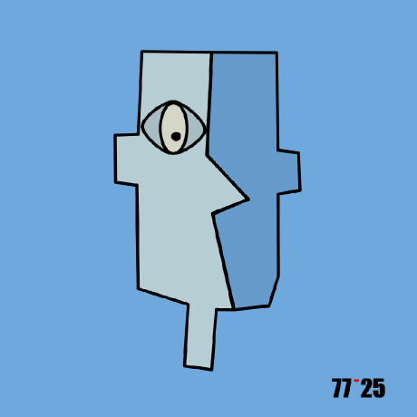

And so you are up to this stage ?! That means you are a bit of a curious.  

As far as I remember, the idea of Barikatec show up in **2017**, perhaps a bit earlier, I don't know, but one of the main starting point (and the only one I can surely check) was the creation of my GitHub account.

I have always been passionate by everything, from going outside to crawling the web. Old enough to remember the sounds of our first modem when, 1 hour per day, we were able to connect to the internet. 

So this site is just a little piece of some of the things I am proud to have work on and wanted to share.

From cooking to crypto, passing by the mountains and through the ocean, I don't know what this site will become but I will try to keep it as clear as possible. You will perhaps not find that much but who knows, if you appreciate something that I have done, this is sufficient for me to be happy with that.

**Barikatec** what does it stands for ?
Barika was the name of a village I heard about when I was very young. A place where my father grew up a part of his childhood. This was a long time ago and, I have never been able to talk about it with him. In french, Barika sounds like "Barrel of", it was the perfect match and I still love it a lot. Barikatec, a barrel of tech or just an home for all the things that I have been curious to dig in.

[[content/my garden/index|My digital garden 🌾]] 
The original idea on how I constructed this site is largely inspired by [kepano](https://x.com/kepano), more details in My Garden.

**AI or not AI**
A quick note on the things you will find it here. So yes, and especially when it is related to code, I have been largely helped by AI to finalise some of the projects you will find. But I am still a human and always loved to write down my thoughts. Therefore, all the texts that you will find here has been written by myself. AI is just another tool for me that breaks the wall of my capabilities in term of codes. 

Want to reach out ? Just contact me on [X](https://x.com/BarikaTec)! 

    <a href="https://x.com/BarikaTec" target="_blank" style="color: inherit; text-decoration: none; display: inline-flex; width: 24px; height: 24px;">
      <svg width="24" height="24" viewBox="0 0 24 24" fill="currentColor"><path d="M18.244 2.25h3.308l-7.227 8.26 8.502 11.24H16.17l-5.214-6.817L4.99 21.75H1.68l7.73-8.835L1.254 2.25H8.08l4.713 6.231zm-1.161 17.52h1.833L7.084 4.126H5.117z"></path></svg>
    </a>
    <a href="https://github.com/barikatec" target="_blank" style="color: inherit; text-decoration: none; display: inline-flex; width: 24px; height: 24px;">
      <svg width="24" height="24" viewBox="0 0 24 24" fill="currentColor"><path d="M12 0c-6.626 0-12 5.373-12 12 0 5.302 3.438 9.8 8.207 11.387.599.111.793-.261.793-.577v-2.234c-3.338.726-4.033-1.416-4.033-1.416-.546-1.387-1.333-1.756-1.333-1.756-1.089-.745.083-.729.083-.729 1.205.084 1.839 1.237 1.839 1.237 1.07 1.834 2.807 1.304 3.492.997.107-.775.418-1.305.762-1.604-2.665-.305-5.467-1.334-5.467-5.931 0-1.311.469-2.381 1.236-3.221-.124-.303-.535-1.524.117-3.176 0 0 1.008-.322 3.301 1.23.957-.266 1.983-.399 3.003-.404 1.02.005 2.047.138 3.006.404 2.291-1.552 3.297-1.23 3.297-1.23.653 1.653.242 2.874.118 3.176.77.84 1.235 1.911 1.235 3.221 0 4.609-2.807 5.624-5.479 5.921.43.372.823 1.102.823 2.222v3.293c0 .319.192.694.801.576 4.765-1.589 8.199-6.086 8.199-11.386 0-6.627-5.373-12-12-12z"></path></svg>
    </a>
  

  
  <h1 style="margin: 0; font-size: 2.5rem; font-weight: 700; border: none;">BarikaTec</h1>
  

  